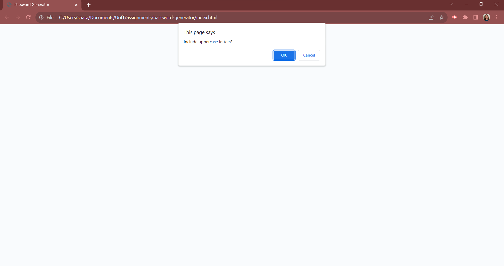

# password-generator

## Description

This project is a random password generator. The password will be generated by going through a list of accepted characters and criterias. 

## Installation

 The CSS, Javascript and images are located in the assets folder. This can be deployed on a web server, such as Github Pages.

## Usage

The user will click on the "Generate Password" button and a generated password will show in the text box on the html. The user will need to go through a series of prompts to select the criteria they would like to use in their password. 

The website can be launched by using GitHub pages, and follwing this URL: https://sabramson16.github.io/password-generator/

## Credits

Credits and ownership goes to Sharon Abramson. 

## License

MIT License

Copyright (c) [2023] [Sharon Abramson]

Permission is hereby granted, free of charge, to any person obtaining a copy
of this software and associated documentation files (the "Software"), to deal
in the Software without restriction, including without limitation the rights
to use, copy, modify, merge, publish, distribute, sublicense, and/or sell
copies of the Software, and to permit persons to whom the Software is
furnished to do so, subject to the following conditions:

The above copyright notice and this permission notice shall be included in all
copies or substantial portions of the Software.

THE SOFTWARE IS PROVIDED "AS IS", WITHOUT WARRANTY OF ANY KIND, EXPRESS OR
IMPLIED, INCLUDING BUT NOT LIMITED TO THE WARRANTIES OF MERCHANTABILITY,
FITNESS FOR A PARTICULAR PURPOSE AND NONINFRINGEMENT. IN NO EVENT SHALL THE
AUTHORS OR COPYRIGHT HOLDERS BE LIABLE FOR ANY CLAIM, DAMAGES OR OTHER
LIABILITY, WHETHER IN AN ACTION OF CONTRACT, TORT OR OTHERWISE, ARISING FROM,
OUT OF OR IN CONNECTION WITH THE SOFTWARE OR THE USE OR OTHER DEALINGS IN THE
SOFTWARE.